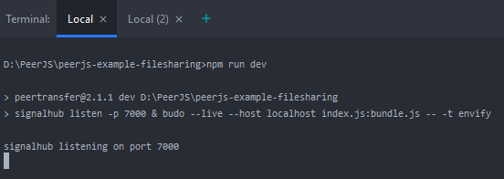
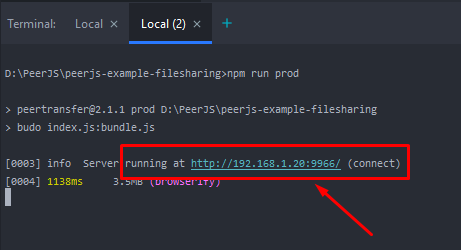

# Install
    
    Install NodeJS
    1. npm install
        
    2. export NODE_ENV=production

    Run server on local port 7000
    3. npm run dev

  

    Run website on local
    4. npm run prod

